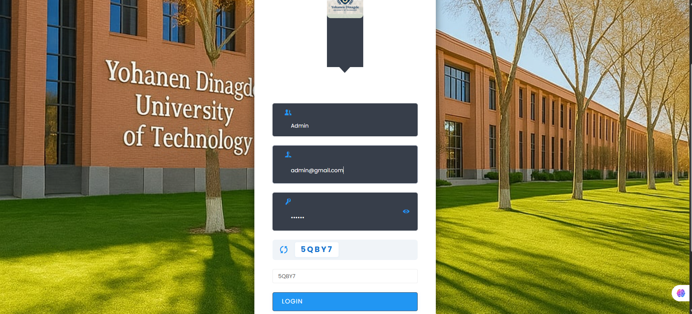
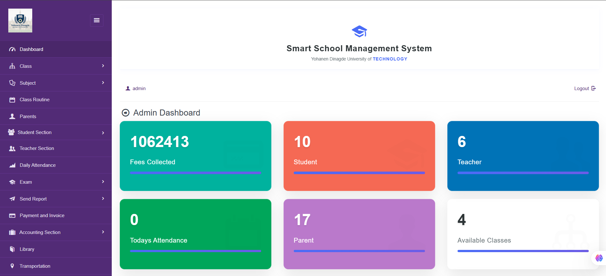
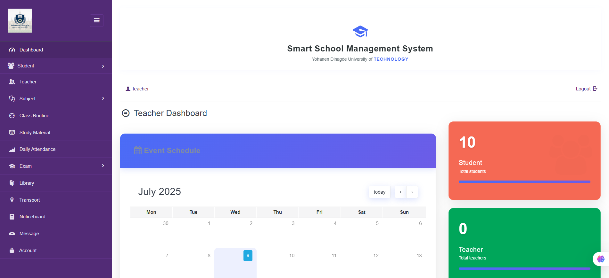
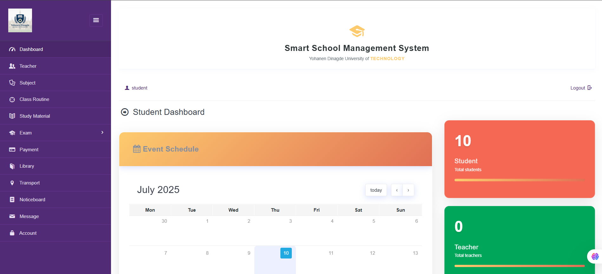
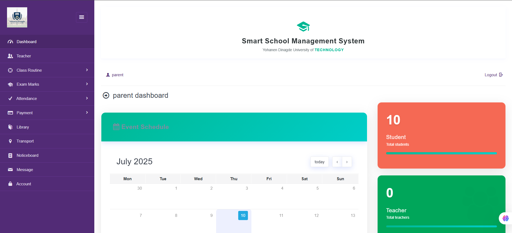

#  Smart School Management System

A complete web-based School Management System developed using **CodeIgniter** framework. The system includes dashboards for Admin, Teachers, Students, and Parents — providing easy management of student data, attendance, marks, and communication.

---

## Key Features

### Admin Dashboard
- Add and manage students, teachers, and parents
- Assign students to classes
- View school-wide reports and system logs

### Teacher Dashboard
- Take and manage student attendance
- View assigned classes
- Print student reports

### Parent Dashboard
- View child’s marks and attendance
- Contact child’s class coordinator or admin

### Student Dashboard
- View personal profile
- Access marks, attendance, and library books

---

## Technologies Used

| Type       | Stack                        |
|------------|------------------------------|
| Backend    | PHP (CodeIgniter Framework)  |
| Frontend   | HTML, CSS, Bootstrap         |
| Database   | MySQL                        |
| Tools      | XAMPP, phpMyAdmin            |

---

## How to Run This Project Locally

### Requirements

- XAMPP (PHP 7.4+ and MySQL)
- Web browser

### Setup Instructions

1. **Install XAMPP**  
   [https://www.apachefriends.org/download.html](https://www.apachefriends.org/download.html)

2. **Clone or Download the Project**
   - Clone this repo using GitHub Desktop, or download the ZIP

3. **Copy the Project Folder**
   - Move the project to:  
     `C:\xampp\htdocs\smart-school-management-system`

4. **Start Apache & MySQL in XAMPP**

5. **Import the Database**
   - Open `http://localhost/phpmyadmin`
   - Create a new DB: `smart_school_db`
   - Click **Import** and select the `.sql` file provided

6. **Configure Database in CodeIgniter**
   - Go to: `/application/config/database.php`
   - Update the following:
     ```php
     'username' => 'root',
     'password' => '',
     'database' => 'smart_school_db',
     ```

7. **Access the System**
   - Open:  
     `http://localhost/smart-school-management-system`

---

## Demo Login Credentials

| Role     | Email                  | Password |
|----------|------------------------|----------|
| Admin    | admin@gmail.com      | 123456   |
| Teacher  | teacher@gmail.com    | 123456   |
| Student  | student@gmail.com    | 123456   |
| Parent   | parent@gmail.com     | 123456   |

---

## Screenshots

## 📸 Screenshots

| Login Page | Admin Dashboard |
|------------|-----------------|
|  |  |

| Teacher Dashboard | Student Dashboard |
|------------------|-------------------|
|  |  |

| Parent Dashboard |
|------------------|
|  |


You can add more screenshots to the `screenshots/` folder as needed._

---

## Project Structure
smart-school-management-system/
├── application/
├── assets/
├── system/
├── index.php
├── README.md
├── .gitignore
└── screenshots/
